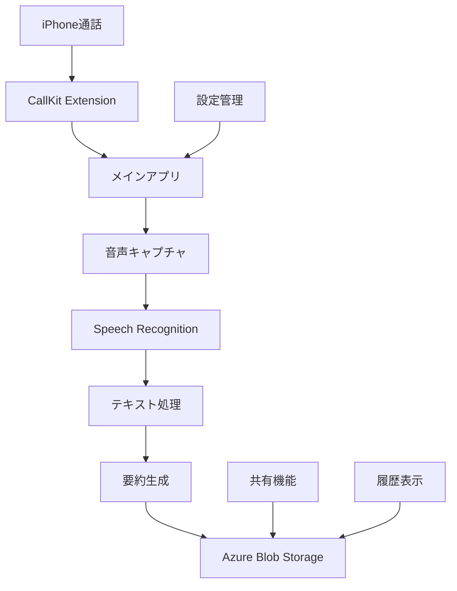
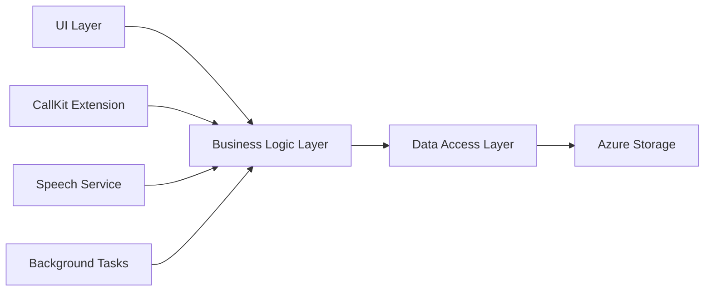

# Design Document

## Overview

電話自動文字起こし・要約アプリは、iPhoneの通話機能と連携し、音声をリアルタイムで文字起こしして要約・保存するネイティブiOSアプリケーションです。Azure Blob Storageをバックエンドストレージとして使用し、同じアプリユーザー間での通話記録共有機能も提供します。

### 技術的制約と対応策

**iOSの通話録音制限**
- iOSは通話中の音声録音を直接サポートしていません
- 対応策：スピーカーフォン使用時のマイク音声キャプチャを利用
- CallKit Extensionを使用して通話状態を監視

**音声認識の実装**
- iOS Speech Framework（SFSpeechRecognizer）を優先使用
- フォールバック：Google Cloud Speech-to-Text API
- リアルタイム処理のためのストリーミング対応

## Architecture

### システム全体構成



### アプリケーション層構成



## Components and Interfaces

### 1. CallKit Extension
**責任**: 通話状態の監視と自動起動
```swift
// CallKit Extension Interface
protocol CallObserverDelegate {
    func callDidStart(_ call: CXCall)
    func callDidEnd(_ call: CXCall)
}

class CallObserver: CXCallObserverDelegate {
    func callObserver(_ callObserver: CXCallObserver, callChanged call: CXCall)
}
```

### 2. Audio Capture Service
**責任**: 音声データのキャプチャと前処理
```swift
protocol AudioCaptureServiceProtocol {
    func startCapture() -> Bool
    func stopCapture()
    func getAudioBuffer() -> AVAudioPCMBuffer?
}

class AudioCaptureService: AudioCaptureServiceProtocol {
    private let audioEngine: AVAudioEngine
    private let inputNode: AVAudioInputNode
}
```

### 3. Speech Recognition Service
**責任**: 音声からテキストへの変換
```swift
protocol SpeechRecognitionServiceProtocol {
    func startRecognition(audioBuffer: AVAudioPCMBuffer) async throws -> String
    func stopRecognition()
    func switchToBackupService() async throws
}

class SpeechRecognitionService: SpeechRecognitionServiceProtocol {
    private let speechRecognizer: SFSpeechRecognizer
    private let googleSpeechClient: GoogleSpeechClient?
}
```

### 4. Text Processing Service
**責任**: テキストの要約と構造化
```swift
protocol TextProcessingServiceProtocol {
    func summarizeText(_ text: String) async throws -> CallSummary
    func structureCallData(_ text: String, metadata: CallMetadata) -> StructuredCallData
}

struct CallSummary {
    let keyPoints: [String]
    let summary: String
    let duration: TimeInterval
    let participants: [String]
}
```

### 5. Azure Storage Service
**責任**: クラウドストレージとの連携
```swift
protocol StorageServiceProtocol {
    func saveCallData(_ data: StructuredCallData) async throws -> String
    func loadCallHistory() async throws -> [CallRecord]
    func deleteCallRecord(_ id: String) async throws
    func shareCallRecord(_ id: String, with userId: String) async throws
}

class AzureStorageService: StorageServiceProtocol {
    private let blobClient: AzureBlobClient
    private let containerName: String = "call-transcriptions"
}
```

### 6. Sharing Service
**責任**: アプリ間での通話記録共有
```swift
protocol SharingServiceProtocol {
    func requestSharing(callId: String, recipientId: String) async throws
    func acceptSharingRequest(_ request: SharingRequest) async throws
    func mergeSharedRecords(_ records: [CallRecord]) async throws -> CallRecord
}
```

## Data Models

### Core Data Models

```swift
struct StructuredCallData: Codable {
    let id: UUID
    let timestamp: Date
    let duration: TimeInterval
    let participantNumber: String
    let audioFileUrl: String
    let transcriptionText: String
    let summary: CallSummary
    let metadata: CallMetadata
    let isShared: Bool
    let sharedWith: [String]
}

struct CallMetadata: Codable {
    let callDirection: CallDirection
    let audioQuality: AudioQuality
    let transcriptionMethod: TranscriptionMethod
    let language: String
    let confidence: Double
}

enum CallDirection: String, Codable {
    case incoming = "incoming"
    case outgoing = "outgoing"
}

enum TranscriptionMethod: String, Codable {
    case iosSpeech = "ios_speech"
    case googleSpeech = "google_speech"
}
```

### Azure Blob Storage Structure

```
Container: call-transcriptions
├── user-{userId}/
│   ├── calls/
│   │   ├── {callId}/
│   │   │   ├── audio.m4a
│   │   │   ├── transcription.json
│   │   │   └── metadata.json
│   │   └── shared/
│   │       └── {sharedCallId}/
│   └── settings/
│       └── user-preferences.json
```

## Error Handling

### エラー分類と対応

1. **音声キャプチャエラー**
   - マイクアクセス拒否 → ユーザーに設定変更を促す
   - 音声品質不良 → 品質警告とフォールバック提案

2. **音声認識エラー**
   - iOS Speech認識失敗 → Google Speech APIに自動切り替え
   - ネットワークエラー → ローカル一時保存

3. **ストレージエラー**
   - Azure接続失敗 → ローカル保存とリトライ機能
   - 容量不足 → 古い記録の削除提案

4. **共有機能エラー**
   - 相手ユーザー未発見 → エラーメッセージと再試行
   - 権限エラー → 適切な権限設定ガイド

### エラーハンドリング実装

```swift
enum AppError: Error {
    case audioPermissionDenied
    case speechRecognitionFailed(underlying: Error)
    case storageConnectionFailed
    case sharingRequestFailed(reason: String)
}

class ErrorHandler {
    static func handle(_ error: AppError) -> UserAction {
        switch error {
        case .audioPermissionDenied:
            return .showSettingsPrompt
        case .speechRecognitionFailed:
            return .switchToBackupService
        case .storageConnectionFailed:
            return .saveLocally
        case .sharingRequestFailed:
            return .showRetryOption
        }
    }
}
```

## Testing Strategy

### 1. Unit Testing
- 各サービスクラスの個別機能テスト
- モックオブジェクトを使用したAPI連携テスト
- エラーハンドリングのテストケース

### 2. Integration Testing
- CallKit Extensionとメインアプリの連携テスト
- Azure Storage APIとの統合テスト
- 音声認識サービスの切り替えテスト

### 3. UI Testing
- 通話開始から記録保存までのE2Eテスト
- 設定画面の操作テスト
- 履歴表示と検索機能のテスト

### 4. Performance Testing
- リアルタイム音声処理の遅延測定
- メモリ使用量の監視
- バッテリー消費量の測定

### 5. Security Testing
- データ暗号化の検証
- Azure認証の安全性テスト
- プライバシー設定の動作確認

### テスト実装例

```swift
class SpeechRecognitionServiceTests: XCTestCase {
    func testIOSSpeechRecognition() async throws {
        let service = SpeechRecognitionService()
        let mockAudioBuffer = createMockAudioBuffer()
        
        let result = try await service.startRecognition(audioBuffer: mockAudioBuffer)
        
        XCTAssertFalse(result.isEmpty)
        XCTAssertGreaterThan(service.confidence, 0.7)
    }
    
    func testFallbackToGoogleSpeech() async throws {
        let service = SpeechRecognitionService()
        service.simulateIOSFailure()
        
        let result = try await service.switchToBackupService()
        
        XCTAssertEqual(service.currentMethod, .googleSpeech)
    }
}
```