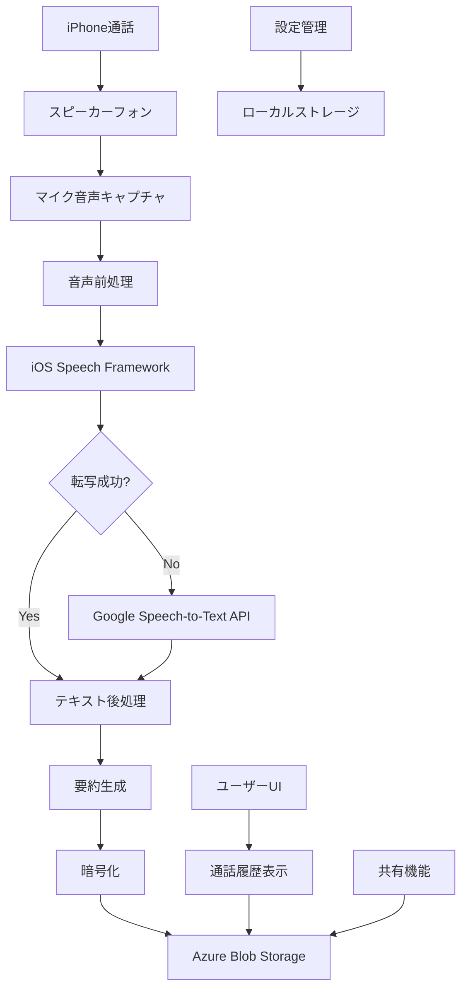

# システムアーキテクチャ概要

## アーキテクチャ全体図

## コンポーネント詳細

### 1. 音声キャプチャレイヤー
- **AVAudioSession**: スピーカーフォン設定とマイクアクセス
- **AVAudioEngine**: リアルタイム音声バッファ取得
- **音声品質監視**: ノイズレベルと音量チェック

### 2. 音声認識レイヤー
- **iOS Speech Framework**: プライマリ転写エンジン
- **Google Speech-to-Text**: フォールバック転写エンジン
- **言語自動検出**: 日本語/英語等の自動識別

### 3. テキスト処理レイヤー
- **自然言語処理**: 文章構造化と整形
- **要約生成**: キーワード抽出と重要文抽出
- **メタデータ付与**: 時刻、発言者、信頼度等

### 4. データ管理レイヤー
- **暗号化処理**: AES-256による音声・テキスト暗号化
- **Azure Blob Storage**: ユーザー別階層化データ保存
- **ローカルキャッシュ**: オフライン対応とパフォーマンス向上

### 5. ユーザーインターフェースレイヤー
- **SwiftUI**: モダンなUI実装
- **リアルタイム表示**: 転写進行状況の可視化
- **アクセシビリティ**: VoiceOver等の対応

## データフロー

### 音声キャプチャフロー
1. 通話開始検知（CallKit）
2. スピーカーフォン自動切り替え
3. マイク音声のリアルタイムキャプチャ
4. 音声バッファの前処理（ノイズ除去等）

### 転写処理フロー
1. iOS Speech Frameworkでの転写試行
2. 信頼度スコア評価
3. 必要に応じてGoogle Speech-to-Text APIにフォールバック
4. 転写結果の品質チェックと後処理

### データ保存フロー
1. 転写テキストと音声の暗号化
2. Azure Blob Storageへのアップロード
3. メタデータのCosmosDBへの保存
4. ローカルキャッシュの更新

## セキュリティ考慮事項

### データ暗号化
- **転送中**: TLS 1.3による通信暗号化
- **保存中**: AES-256による音声・テキストデータ暗号化
- **キー管理**: iOS Keychainでの暗号化キー保存

### プライバシー保護
- **ユーザー同意**: 録音・転写前の明示的同意取得
- **データ削除**: ユーザー要求による完全データ削除
- **アクセス制御**: ユーザー別データ分離

### 認証・認可
- **Azure AD**: ユーザー認証とアクセス管理
- **JWT Token**: API認証トークン管理
- **デバイス認証**: デバイス固有識別子による追加セキュリティ

## パフォーマンス最適化

### リアルタイム処理
- **ストリーミング転写**: 4KBチャンクでの逐次処理
- **並列処理**: 音声キャプチャと転写の並行実行
- **バッファリング**: 適応的バッファサイズ調整

### ネットワーク最適化
- **圧縮**: Opusコーデックによる音声圧縮
- **CDN**: Azure CDNによる配信最適化
- **キャッシュ戦略**: 多層キャッシュによる応答速度向上

### メモリ管理
- **ARC最適化**: Swift ARCによる自動メモリ管理
- **バックグラウンド処理**: 効率的なバックグラウンドタスク管理
- **リソース監視**: メモリ使用量の動的監視とアラート