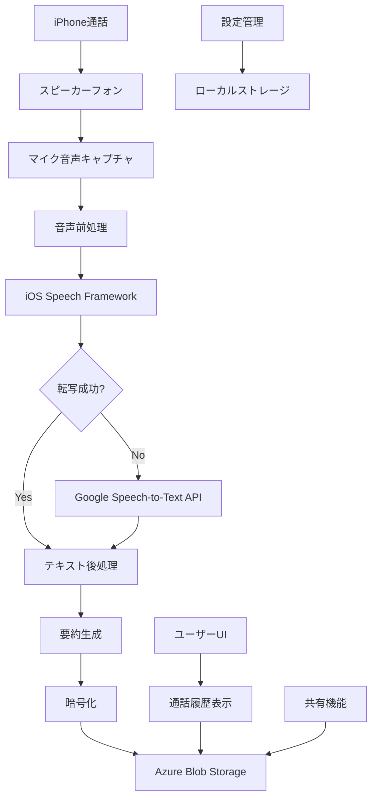

# TelreqApp - iPhone電話自動文字起こし・要約アプリ

## プロジェクト概要

TelreqAppは、iPhoneで通話内容を自動的に文字起こしし、要約・保存するiOSネイティブアプリケーションです。

### 主要機能

1. **リアルタイム音声転写**: iOS Speech Framework（優先）とGoogle Speech-to-Text API（フォールバック）
2. **自動要約生成**: 通話内容の重要ポイント抽出とキーワード抽出
3. **クラウドストレージ**: Azure Blob Storageでの安全なデータ保存
4. **共有機能**: ユーザー間での通話記録共有
5. **プライバシー保護**: AES-256暗号化とSecure Enclaveによるセキュリティ
6. **オフライン対応**: ローカルキャッシュとオフラインデータ管理
7. **通話管理**: CallKitとの統合による通話フロー制御

### 技術スタック

- **言語**: Swift 5.7+
- **フレームワーク**: SwiftUI, AVFoundation, Speech Framework, CallKit
- **プラットフォーム**: iOS 15.0+
- **データベース**: Core Data, SQLite
- **クラウド**: Azure Storage Blobs SDK
- **暗号化**: CryptoKit, Secure Enclave
- **依存関係管理**: Swift Package Manager

### 技術制約への対応

- **iOS通話録音制限**: スピーカーフォン+マイク録音方式を採用
- **App Store承認**: プライバシー規制とAppleガイドラインに完全準拠
- **リアルタイム処理**: 低遅延での音声処理とUIフィードバック

## プロジェクト構造

```
TelreqApp/
├── Sources/
│   ├── Core/                           # コアビジネスロジック
│   │   ├── Models/                    # データモデル定義
│   │   │   └── CallData.swift         # 通話データ・要約モデル
│   │   ├── Protocols/                 # プロトコル定義
│   │   │   └── ServiceProtocols.swift # サービス層プロトコル
│   │   └── TelreqDataModel.xcdatamodeld # Core Dataモデル
│   ├── Services/                       # サービス層実装
│   │   ├── ServiceContainer.swift     # 依存性注入コンテナ
│   │   ├── AudioCaptureService.swift  # 音声キャプチャ (454行)
│   │   ├── SpeechRecognitionService.swift # 音声認識 (603行)
│   │   ├── TextProcessingService.swift # テキスト処理・要約 (711行)
│   │   ├── EncryptionService.swift    # 暗号化サービス (538行)
│   │   ├── AzureStorageService.swift  # Azure連携 (759行)
│   │   ├── OfflineDataManager.swift   # オフラインデータ管理 (781行)
│   │   └── CallManager.swift          # 通話制御 (653行)
│   ├── UI/                            # SwiftUIビュー
│   │   ├── ContentView.swift          # メインビュー (462行)
│   │   ├── RealTimeTranscriptionView.swift # リアルタイム転写 (1081行)
│   │   ├── CallHistoryView.swift      # 通話履歴 (714行)
│   │   ├── CallDetailView.swift       # 通話詳細 (887行)
│   │   ├── SettingsView.swift         # 設定画面 (1129行)
│   │   └── SharingView.swift          # 共有機能 (1101行)
│   ├── Features/                      # 機能別モジュール
│   └── Extensions/                    # 拡張機能
├── Tests/
│   ├── Unit/                          # ユニットテスト
│   ├── Integration/                   # 統合テスト
│   └── UI/                            # UIテスト
├── Resources/
│   ├── Assets/                        # アセット・画像
│   └── Localization/                  # 多言語対応
├── Documentation/
│   ├── API/                           # API仕様書
│   ├── Architecture/                  # アーキテクチャ設計
│   │   └── system-overview.md         # システム概要とMermaid図
│   └── Deployment/                    # デプロイメント手順
├── Configuration/
│   ├── Development/                   # 開発環境設定
│   ├── Production/                    # 本番環境設定
│   │   ├── APIKeys.plist.template     # API キーテンプレート
│   │   └── AzureOpenAI.plist.template # Azure設定テンプレート
│   └── Staging/                       # ステージング環境設定
├── Package.swift                      # Swift Package Manager設定
├── Info.plist                         # アプリケーション設定
└── TelreqAppApp.swift                 # メインアプリケーション
```

### 実装規模

- **総実装行数**: 約13,000行
- **サービス層**: 8ファイル、3,799行
- **UI層**: 6ファイル、5,374行
- **コア層**: データモデルとプロトコル定義
- **テスト**: ユニット・統合・UIテスト対応

## システムアーキテクチャ

### アーキテクチャ概要



### コンポーネント詳細

#### 1. 音声キャプチャレイヤー (`AudioCaptureService`)
- **AVAudioSession**: スピーカーフォン設定とマイクアクセス
- **AVAudioEngine**: リアルタイム音声バッファ取得
- **音声品質監視**: ノイズレベルと音量チェック

#### 2. 音声認識レイヤー (`SpeechRecognitionService`)
- **iOS Speech Framework**: プライマリ転写エンジン
- **Google Speech-to-Text**: フォールバック転写エンジン
- **言語自動検出**: 日本語/英語等の自動識別

#### 3. テキスト処理レイヤー (`TextProcessingService`)
- **自然言語処理**: 文章構造化と整形
- **要約生成**: キーワード抽出と重要文抽出
- **メタデータ付与**: 時刻、発言者、信頼度等

#### 4. データ管理レイヤー (`EncryptionService`, `AzureStorageService`, `OfflineDataManager`)
- **暗号化処理**: AES-256による音声・テキスト暗号化
- **Azure Blob Storage**: ユーザー別階層化データ保存
- **ローカルキャッシュ**: オフライン対応とパフォーマンス向上

#### 5. ユーザーインターフェースレイヤー (SwiftUI Views)
- **SwiftUI**: モダンなUI実装
- **リアルタイム表示**: 転写進行状況の可視化
- **アクセシビリティ**: VoiceOver等の対応

## 依存関係

### Swift Packages

```swift
dependencies: [
    .package(url: "https://github.com/Azure/azure-sdk-for-ios.git", from: "1.0.0"),
    .package(url: "https://github.com/stephencelis/SQLite.swift.git", from: "0.14.1")
]
```

### システム要件

- **iOS**: 15.0以上
- **Xcode**: 14.0以上
- **Swift**: 5.7以上
- **Azure Storage**: アカウントとコンテナの設定が必要
- **デバイス**: iPhone (iPadは非対応)

## 開発フェーズ

### Phase 1: MVP（基本転写機能）
- スピーカーフォン音声キャプチャ
- iOS Speech Framework統合
- 基本的なUI実装

### Phase 2: クラウド統合
- Azure Blob Storage連携
- 要約機能実装
- データ暗号化

### Phase 3: 共有機能
- ユーザー認証システム
- 通話記録共有機能
- プライバシー制御

### Phase 4: 最適化・拡張
- パフォーマンス最適化
- 追加言語サポート
- エンタープライズ機能

## 要件と制約

詳細な要件定義は `.kiro/specs/phone-call-transcription/` ディレクトリを参照してください。

## セットアップガイド

### 1. 前提条件

- macOS 12.0以上
- Xcode 14.0以上
- iOS Developer Account（デバイステスト用）
- Azure Storage Account（クラウド機能用）

### 2. プロジェクトのクローンとビルド

```bash
# リポジトリのクローン
git clone https://github.com/NikoToRA/telreq.git
cd telreq/TelreqApp

# Swift Packageの依存関係を解決
swift package resolve

# Xcodeでプロジェクトを開く
open TelreqApp.xcodeproj
```

### 3. 設定ファイルの準備

#### Azure Storage設定

```bash
# 本番環境設定ファイルを作成
cp Configuration/Production/AzureOpenAI.plist.template Configuration/Production/AzureOpenAI.plist
cp Configuration/Production/APIKeys.plist.template Configuration/Production/APIKeys.plist
```

`AzureOpenAI.plist`を編集：
```xml
<?xml version="1.0" encoding="UTF-8"?>
<!DOCTYPE plist PUBLIC "-//Apple//DTD PLIST 1.0//EN" "http://www.apple.com/DTDs/PropertyList-1.0.dtd">
<plist version="1.0">
<dict>
    <key>StorageAccountName</key>
    <string>YOUR_STORAGE_ACCOUNT</string>
    <key>StorageAccountKey</key>
    <string>YOUR_STORAGE_KEY</string>
    <key>ContainerName</key>
    <string>telreq-data</string>
</dict>
</plist>
```

### 4. デバイス設定

1. **マイクアクセス許可**: Settings > Privacy & Security > Microphone > TelreqApp
2. **音声認識許可**: Settings > Privacy & Security > Speech Recognition > TelreqApp
3. **スピーカーフォン**: 通話中にスピーカーボタンをタップ

### 5. ビルドとデプロイ

```bash
# Debug builds
xcodebuild -scheme TelreqApp -configuration Debug -destination 'platform=iOS Simulator,name=iPhone 14' build

# Release builds
xcodebuild -scheme TelreqApp -configuration Release -destination 'generic/platform=iOS' build
```

## API仕様

### サービスアーキテクチャ

#### ServiceContainer (依存性注入)
```swift
final class ServiceContainer: ObservableObject {
    lazy var encryptionService: EncryptionServiceProtocol
    lazy var offlineDataManager: OfflineDataManagerProtocol  
    lazy var azureStorageService: StorageServiceProtocol
    lazy var speechRecognitionService: SpeechRecognitionServiceProtocol
    lazy var textProcessingService: TextProcessingServiceProtocol
    lazy var audioService: AudioCaptureServiceProtocol
    lazy var callManager: CallManagerProtocol
}
```

#### 主要プロトコル

**AudioCaptureServiceProtocol**
```swift
protocol AudioCaptureServiceProtocol {
    func startCapture() async throws
    func stopCapture()
    var audioLevelPublisher: AnyPublisher<Float, Never> { get }
    var isCapturing: Bool { get }
}
```

**SpeechRecognitionServiceProtocol**
```swift
protocol SpeechRecognitionServiceProtocol {
    func startTranscription() async throws
    func stopTranscription()
    var transcriptionResultPublisher: AnyPublisher<String, Never> { get }
    var isTranscribing: Bool { get }
}
```

### データモデル

#### StructuredCallData
```swift
struct StructuredCallData: Codable, Identifiable {
    let id: UUID
    let timestamp: Date
    let duration: TimeInterval
    let participantNumber: String
    let audioFileUrl: String
    let transcriptionText: String
    let summary: CallSummary
    let metadata: CallMetadata
    let isShared: Bool
    let sharedWith: [String]
}
```

#### CallSummary
```swift
struct CallSummary: Codable {
    let keyPoints: [String]
    let summary: String
    let actionItems: [String]
    let sentiment: SentimentAnalysis
    let confidence: Double
}
```

## トラブルシューティング

### よくある問題

1. **音声キャプチャが機能しない**
   - マイクアクセス許可を確認
   - スピーカーフォンが有効になっているか確認

2. **Azure Storage接続エラー**
   - 設定ファイルのストレージキーを確認
   - ネットワーク接続を確認

3. **音声認識の精度が低い**
   - 静かな環境での通話を推奨
   - スピーカーの音量を適切に調整

### ログとデバッグ

```swift
// ログレベルの設定
os_log(.debug, log: Logger(subsystem: "com.telreq.app", category: "AudioCapture"), "Audio capture started")
```

## ライセンス

MIT License - 詳細は[LICENSE](LICENSE)ファイルを参照

## 貢献

1. フォークを作成
2. フィーチャブランチを作成 (`git checkout -b feature/AmazingFeature`)
3. 変更をコミット (`git commit -m 'Add some AmazingFeature'`)
4. ブランチにプッシュ (`git push origin feature/AmazingFeature`)
5. Pull Requestを作成

## サポート

- Issues: [GitHub Issues](https://github.com/NikoToRA/telreq/issues)
- Documentation: `Documentation/`ディレクトリ内の詳細資料